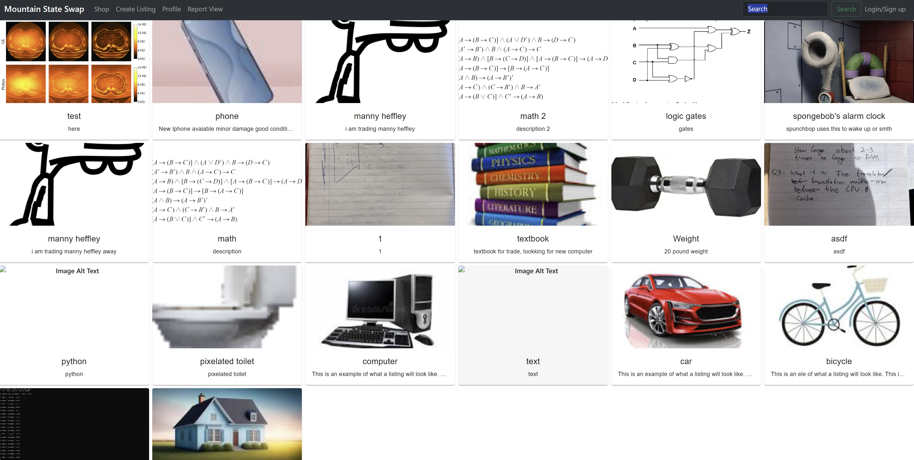

# README

## Project Summary
Mountain State Swap

This platform serves as a trading hub for the people of Morgantown, enabling individuals to showcase items available for trade. It provides a user-friendly interface where members can list items they want to exchange, facilitating local transactions within the community. Additionally, the platform includes a messaging system allowing users to communicate privately with each other to discuss trade details, negotiate, and arrange meetups. To ensure the safety and reliability of the trading environment, a comprehensive rating and reporting system is integrated. This system allows users to rate their trading experiences and report any suspicious or unsafe activity, fostering a secure trading atmosphere within the Morgantown community.

## Motivation
This project is driven by the aspiration to cultivate a connected community in Morgantown through a dedicated platform for item exchanges, aiming to facilitate local interactions and the sharing of goods.

## Code style
We used CSS for styling. 
 
## Store Page

   
## Tech/Framework used: React + Vite

This template provides a minimal setup to get React working in Vite with HMR and some ESLint rules.

Currently, two official plugins are available:

- [@vitejs/plugin-react](https://github.com/vitejs/vite-plugin-react/blob/main/packages/plugin-react/README.md) uses [Babel](https://babeljs.io/) for Fast Refresh
- [@vitejs/plugin-react-swc](https://github.com/vitejs/vite-plugin-react-swc) uses [SWC](https://swc.rs/) for Fast Refresh

<b>Built with</b>
- [Visual Studio Code](https://https://code.visualstudio.com/download)

## Features
Our project has a focus on the trader, allowing them to easily navigate the site and safely trade with other users. 

## Tests
Describe and show how to run the tests with code examples.

## How to use?
If you would like to start trading: 
1: Create an account.   
2: Sign in  
3: Grab an image of your item.   
4: Upload it with a description and title.   
5: Browse the site, and see if there are any items that you would like.   
6: If so, click the item, and initiate a trade with the user.   
7: If you would like to communicate with the user, use the messaging feature.  

## Contributors
Devin Booth  
Declan Ware  
Hunter Harris   
Ian Hoopes  
Riley Potter  
Dhyan Patel   
Branden Purdum  
